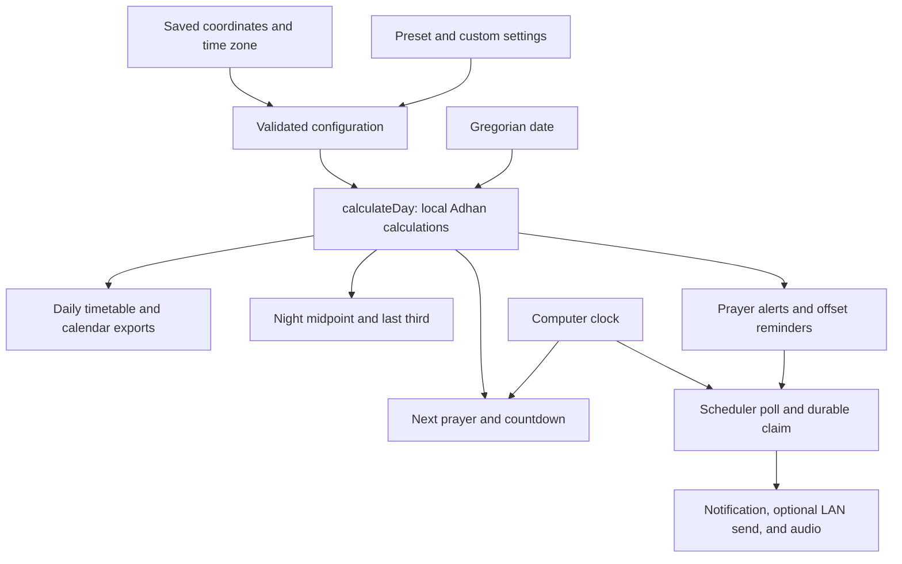

# Calculations and timing retrieval

Athan calculates prayer times on the device from a saved location, a Gregorian date, and calculation settings. It does not download a prayer timetable. The desktop app, CLI, calendar exports, and alert scheduler all use the same `calculateDay()` implementation.

This guide describes the current source and the pinned **Adhan 4.4.6** dependency. It documents the app's behavior, including its overrides of library defaults. The source links under `node_modules` are available after `npm.cmd ci`.

## Contents

- [Where the data comes from](#where-the-data-comes-from)
- [Inputs and defaults](#inputs-and-defaults)
- [Dates, time zones, and daylight saving](#dates-time-zones-and-daylight-saving)
- [How the six daily times are calculated](#how-the-six-daily-times-are-calculated)
- [Calculation presets and overrides](#calculation-presets-and-overrides)
- [High latitudes and polar fallback](#high-latitudes-and-polar-fallback)
- [Night midpoint and last third](#night-midpoint-and-last-third)
- [Next prayer and countdown](#next-prayer-and-countdown)
- [Qibla bearing](#qibla-bearing)
- [Hijri dates and Islamic observances](#hijri-dates-and-islamic-observances)
- [Calendar generation and exports](#calendar-generation-and-exports)
- [Alerts, reminders, and playback timing](#alerts-reminders-and-playback-timing)
- [Worked example](#worked-example)
- [Inspecting and verifying results](#inspecting-and-verifying-results)
- [Source map](#source-map)

## Where the data comes from

| Value | Source | When it is retrieved or calculated |
|---|---|---|
| Active location and calculation settings | Local configuration JSON, validated by Zod | Each CLI command and desktop snapshot; once when a scheduler starts |
| Latitude, longitude, and IANA time zone | Saved location, entered manually or selected from search | Setup or an explicit location change |
| Optional online city results | Open-Meteo geocoding endpoint, with GeoNames attribution | Only an explicit online search |
| Six daily times and sunset | Local Adhan astronomy and Athan's settings wrapper | A daily calculation; no prayer-time API request |
| Night midpoint and last third | Today's calculated Maghrib and tomorrow's calculated Fajr | Each daily calculation |
| Next prayer | Locally calculated prayers around the current local date | Each next-prayer request, desktop snapshot, or tray refresh |
| Current instant | Computer clock (`new Date()` / `Date.now()`) | Requests, countdown updates, and scheduler polls |
| Time-zone offsets and Hijri conversion | Runtime `Intl`/ICU data | Local date conversion and formatting |
| Qibla | Saved coordinates and the library's Kaaba coordinates | Each daily calculation |
| Delivery history | Local SQLite ledger | CLI history or desktop snapshots |



### Location retrieval

The active location is the entry in `config.locations` whose `id` matches `config.activeLocation`. Changing the location changes the coordinates and time zone used for subsequent calculations; it does not automatically choose a regional calculation method.

Offline search filters the nine entries in `BUILTIN_LOCATIONS` by city/country text. Saved locations are read separately from configuration. Manual coordinates require a time zone; the app does not infer a zone from latitude and longitude or automatically track the device's location.

Online search calls `https://geocoding-api.open-meteo.com/v1/search` with `name`, `count=20`, and `language=en`. The CLI can also send a two-letter `countryCode`. Search text must contain at least two characters after trimming and be no more than 150 characters. The request has a 10-second timeout; non-success HTTP responses, invalid data, and responses over 200,000 characters are errors. Results provide coordinates and `timezone`, are validated as locations, and receive IDs such as `geonames-12345`. A chosen result must be saved to become a calculation input. A failed lookup leaves offline calculations available.

Legacy catalogue search reads the installed XML files on demand. It divides stored latitude/longitude by 10,000 and the old UTC offset by 100. It returns `timeZone: null`: the numeric offset is reference data, not a modern DST rule. Legacy configuration import uses the selected city's coordinates directly, prefers supplied VirtualStore overrides, and requires an explicitly supplied method and IANA zone; it does not decode old method/DST codes.

Sources: [configuration](../src/config.ts), [locations and legacy import](../src/locations.ts), [online lookup](../src/geocoding.ts).

## Inputs and defaults

These are `defaultConfig()` and schema defaults, not a claim about a user's current saved settings. All locations share the one `calculation` configuration.

| Input | Default | Meaning / accepted range |
|---|---|---|
| Location | Coburg, Victoria: `-37.75`, `144.9667` | Latitude −89.9…89.9; longitude −180…180; north/east positive |
| Time zone | `Australia/Melbourne` | Zone accepted by runtime `Intl`; use an IANA name |
| `method` | `MuslimWorldLeague` | Preset listed below, or `Other` |
| `madhab` | `Shafi` | Standard shadow factor 1; `Hanafi` uses 2 |
| `highLatitudeRule` | `TwilightAngle` | Twilight-angle, half-night, or seventh-night bounds |
| `polarResolution` | `Unresolved` | No substitution, nearby latitude, or nearby date |
| `fajrAngle`, `ishaAngle` | Preset | Optional degrees below horizon, greater than 0 and at most 30 |
| `ishaInterval` | Preset | Optional integer 0…240 minutes; a positive value takes precedence over the Isha angle |
| `maghribAngle` | Preset | Optional 0…20 degrees; 0 disables the angle |
| `dhuhrAfterNoon` | 1 minute | Integer 0…30; replaces the preset Dhuhr margin |
| `maghribAfterSunset` | 1 minute | Integer 0…30; replaces the preset Maghrib margin; follows angle-based Maghrib when used |
| `adjustments` | 0 for all six times | Additional integer −180…180 minutes per time |
| `ramadanIshaExtra` | 30 minutes | Integer 0…60; applied only to positive-interval `UmmAlQura` during adjusted Hijri month 9 |
| `hijriAdjustment` | 0 days | Integer −2…2 |
| `hour12`, `locale` | `true`, `en-AU` | Formatting preferences; do not change the underlying instants |

Invalid configuration fails validation. Unknown keys, duplicate location/reminder IDs, and an active location ID absent from the saved list are rejected. For `Other`, supply a Fajr angle and either an Isha angle or a positive Isha interval.

Source: [schema and defaults](../src/config.ts).

## Dates, time zones, and daylight saving

The app distinguishes a **civil date** such as `2026-09-15` from an **instant** such as `2026-09-14T18:54:00.000Z`. That UTC instant is Fajr on September 15 in the worked Coburg example. Its previous UTC date is expected.

1. `dateAt(now, location.timeZone)` obtains today's year/month/day in the active location's zone. The host computer's calendar date is not used as the location's date.
2. `parseDate()` validates a real `YYYY-MM-DD` date in 1900–2100 and represents its calendar fields using noon UTC. `addDays()` moves these date labels by whole 86,400,000-millisecond steps.
3. Adhan reads host-local calendar fields from its input `Date`. The wrapper therefore builds a host-local **noon with the requested year/month/day**, rather than passing a UTC-midnight instant that could have different local fields. Adhan returns UTC instants.
4. The wrapper checks the local date of the computed Dhuhr. If it differs from the requested date, it recomputes once with the solar date shifted by that whole-day difference. This handles civil zones across the solar date line, such as Kiritimati.
5. `Intl.DateTimeFormat` formats each instant in the saved time zone, using the offset applicable to that instant. There is no manual one-hour DST addition.

Adding a calendar day is different from adding 24 hours to a local prayer time across a DST change. Night lengths, reminders, and countdowns use differences between actual UTC instants, so offset changes are already accounted for.

Prayer results serialize to ISO UTC strings; unavailable values serialize as `null`. CLI time text uses `config.locale` and `hour12`; the tray does too. Desktop time/date text currently uses `en-AU` with the configured 12/24-hour choice. CSV uses 24-hour `en-AU` formatting. A runtime update can change ICU time-zone or calendar data, so record the runtime version when comparing fixtures.

Neighbouring dates also need to be supported: `calculateDay()` calculates tomorrow, and next-prayer/scheduler searches use additional surrounding days. Requests at the outer date limits can therefore fail even if the requested day itself passes `parseDate()`.

Sources: [date helpers](../src/dates.ts), [calculation wrapper](../src/prayers.ts), [desktop formatting](../ui/src/shared.tsx).

## How the six daily times are calculated

Adhan computes the Sun's position for the requested solar date and neighbouring dates. Its `SolarCoordinates` and `Astronomical` helpers derive solar declination, right ascension, and apparent sidereal time from the Julian day. `SolarTime` interpolates the neighbouring values and corrects the transit and horizon-crossing estimates. There is no weather, terrain, building-height, or live sunrise feed in these inputs.

The central altitude relationship is:

```text
sin(h) = sin(phi) * sin(delta) + cos(phi) * cos(delta) * cos(H)
H0 = acos((sin(h) - sin(phi) * sin(delta)) / (cos(phi) * cos(delta)))
```

Here `phi` is observer latitude, `delta` is solar declination, `h` is the desired solar altitude, and `H` is the local hour angle. Angles are in degrees in the library's public calculations and converted to radians for trigonometric functions. The initial event estimate is solar transit minus `H0/15` hours for a morning crossing or plus `H0/15` for an evening crossing. The library then corrects that estimate using interpolated solar coordinates; this simple equation alone is not a replacement for the full implementation.

| Time | Base calculation before margins, manual adjustments, and rounding |
|---|---|
| **Fajr** | Morning crossing at altitude `-fajrAngle`, subject to the twilight bounds below |
| **Sunrise** | Morning crossing at altitude `-50/60` degrees (approximately −0.8333°), the library's fixed horizon allowance |
| **Dhuhr** | Corrected solar transit, when the Sun crosses the local meridian; not fixed clock noon |
| **Asr** | Afternoon crossing at the altitude determined by the selected shadow factor |
| **Maghrib** | Sunset by default, or a qualifying evening `-maghribAngle` crossing |
| **Isha** | Evening crossing at `-ishaAngle`, subject to twilight bounds, or a positive fixed interval after unadjusted sunset |

### Asr

```text
shadowFactor = 1 for Shafi, 2 for Hanafi
asrAltitude = atan(1 / (shadowFactor + tan(abs(phi - delta))))
```

Adhan solves for that positive altitude after solar transit. The shadow criterion includes the noon shadow in addition to the selected multiple of object height. Changing madhab changes Asr; it does not change the other five base times.

### Sunset, Maghrib, and interval-based Isha

`DailyTimes.sunset` is the separately rounded astronomical sunset, without Maghrib margins or manual adjustments. It is available in JSON/core output, but is not an extra seventh timetable card.

For angle-based Maghrib, the library accepts the angle crossing only if it is strictly **after sunset and before the base Isha time**. Otherwise it keeps sunset as the Maghrib base. It then adds `maghribAfterSunset` and `adjustments.maghrib`. Despite the setting's name, this margin follows the accepted angle crossing when one is used.

A positive Isha interval uses the **unadjusted sunset instant**, before rounding, plus the interval. Moving displayed Maghrib does not move interval-based Isha. With the default one-minute Maghrib margin, a 90-minute Isha interval will ordinarily appear 89 minutes after displayed Maghrib when other offsets are zero.

Sources: [daily wrapper](../src/prayers.ts), Adhan [SolarTime](../node_modules/adhan/lib/esm/SolarTime.js), [SolarCoordinates](../node_modules/adhan/lib/esm/SolarCoordinates.js), [Astronomical](../node_modules/adhan/lib/esm/Astronomical.js), and [PrayerTimes](../node_modules/adhan/lib/esm/PrayerTimes.js).

## Calculation presets and overrides

The table lists the installed presets **as used by Athan before optional custom overrides**. All angle values are degrees below the horizon. Every row uses the configured Dhuhr and Maghrib margins (both default to +1 minute), replacing the library's margins for those two prayers.

| Method key | Fajr | Isha | Maghrib base | Other retained preset behavior |
|---|---|---|---|---|
| `MuslimWorldLeague` | 18° | 17° | Sunset | None |
| `Karachi` | 18° | 18° | Sunset | None |
| `NorthAmerica` (ISNA) | 15° | 15° | Sunset | None |
| `UmmAlQura` | 18.5° | Sunset + 90 min | Sunset | App adds Ramadan extra when applicable |
| `Egyptian` | 19.5° | 17.5° | Sunset | None |
| `Dubai` | 18.2° | 18.2° | Sunset | Sunrise −3 min; Asr +3 min |
| `MoonsightingCommittee` | 18° | 18° | Sunset | Seasonal twilight bounds and northern high-latitude rule |
| `Kuwait` | 18° | 17.5° | Sunset | None |
| `Qatar` | 18° | Sunset + 90 min | Sunset | No automatic Ramadan extra |
| `Singapore` | 20° | 18° | Sunset | Round up |
| `Tehran` | 17.7° | 14° | 4.5° evening crossing, if valid | Maghrib crossing must fall between sunset and Isha |
| `Turkey` | 18° | 17° | Sunset | Sunrise −7 min; Asr +4 min |
| `Other` | Required custom angle | Custom angle or positive interval | Sunset unless overridden | Schema rejects incomplete custom settings |

### Order of application

Each calculation creates a fresh parameter object; offsets do not accumulate between calls.

1. Load the selected preset.
2. Set the configured madhab, high-latitude rule, and polar resolution.
3. Apply an explicit Fajr angle if present.
4. Apply an explicit Isha angle if present, clearing any preset Isha interval to zero.
5. Apply an explicit Isha interval if present. A positive interval therefore wins if both angle and interval were supplied; zero selects the angle path.
6. Apply an explicit Maghrib angle if present.
7. Replace the preset Dhuhr and Maghrib margins with `dhuhrAfterNoon` and `maghribAfterSunset`; retain the other preset adjustments.
8. Copy the six signed manual adjustments.
9. If the method is `UmmAlQura`, the effective interval is positive, and `toHijri(date, hijriAdjustment).month === 9`, add `ramadanIshaExtra` to that interval.
10. Compute solar events, apply the relevant fallbacks/bounds, add the two adjustment layers, then round.

For each of the six times:

```text
finalTime = roundAccordingToPreset(
    baseTime + 60,000 * (effectivePresetMargin + manualAdjustment)
)
```

For Dhuhr and Maghrib, `effectivePresetMargin` is the app's explicit margin. For example, Dhuhr with a +1-minute margin and −2-minute manual adjustment is rounded solar transit minus 1 minute. Dubai sunrise keeps its −3-minute preset adjustment; a +2-minute manual adjustment makes the net shift −1 minute.

Most presets round to the nearest minute: seconds below 30 go down, seconds 30 or above go up. Singapore uses Adhan's `Up` rule, which adds `60 - seconds`; in this version even an exact `:00` advances to the next minute. The app has no separate rounding setting. The library constructs solar event components at whole-second precision before this rounding.

The Ramadan change uses the corrected Hijri date, so changing `hijriAdjustment` can move the day on which the Isha extension starts or ends. It applies to an overridden positive interval under `UmmAlQura` too. An angle-only Isha under that method gets no extra minutes. Each neighbouring day's calculation checks Ramadan independently.

Sources: [override order](../src/prayers.ts), Adhan [presets](../node_modules/adhan/lib/esm/CalculationMethod.js), [parameters](../node_modules/adhan/lib/esm/CalculationParameters.js), and [rounding](../node_modules/adhan/lib/esm/DateUtils.js).

## High latitudes and polar fallback

### Twilight bounds

For ordinary methods, Adhan limits how early Fajr or how late angle-based Isha may be. Let `Nsolar` be the elapsed duration from **today's unadjusted sunset to tomorrow's unadjusted sunrise**. The installed library uses that duration for both bounds, including today's Fajr bound:

```text
safeFajr = today's unadjusted sunrise - fajrPortion * Nsolar
safeIsha = today's unadjusted sunset  + ishaPortion * Nsolar
Fajr = later of angle-based Fajr and safeFajr
Isha = earlier of angle-based Isha and safeIsha
```

If an angle crossing is invalid, the corresponding safe value is used instead, if available. These checks run wherever the method uses them, not only above a particular latitude. Manual adjustments are applied afterwards, so they can move the final value beyond a bound.

| `highLatitudeRule` | Fajr portion | Isha portion |
|---|---|---|
| `MiddleOfTheNight` | 1/2 | 1/2 |
| `SeventhOfTheNight` | 1/7 | 1/7 |
| `TwilightAngle` | `fajrAngle / 60` | `ishaAngle / 60` |

Positive-interval Isha bypasses the angle calculation and its safe-Isha limit. These solar-night bounds are separate from the app's displayed Maghrib-to-Fajr night fractions.

### Moonsighting Committee

This preset retains Adhan's seasonal bounds instead of the ordinary `highLatitudeRule` fractions. Athan leaves `shafaq` at the library default, `General`.

To obtain the seasonal offset in minutes, let `L = abs(latitude)` and calculate four anchors:

| Bound | A | B | C | D |
|---|---|---|---|---|
| Morning | `75 + 28.65*L/55` | `75 + 19.44*L/55` | `75 + 32.74*L/55` | `75 + 48.10*L/55` |
| Evening (`General`) | `75 + 25.60*L/55` | `75 + 2.05*L/55` | `75 - 9.21*L/55` | `75 + 6.14*L/55` |

The library linearly interpolates through `(day, offset)` anchors `(0,A)`, `(91,B)`, `(137,C)`, `(183,D)`, `(229,C)`, `(275,B)`, `(366,A)`. Its day index is the one-based day of year plus 10 in the northern hemisphere, wrapping at the year length; in the southern hemisphere it subtracts 172 (173 in leap years), adding the year length if negative. Morning offset is subtracted from sunrise; evening offset is added to sunset, with the signed offsets rounded to whole seconds.

Additionally, at **latitude ≥ 55° north**, it initially replaces Fajr with sunrise minus `Nsolar/7` and angle-based Isha with sunset plus `Nsolar/7`, then still applies the seasonal bounds. This check uses signed latitude in Adhan 4.4.6; it is not an absolute-latitude test. Changing custom angles does not remove the preset's method-specific seasonal behavior.

### Missing sunrise or sunset

If today's sunrise/sunset or tomorrow's sunrise cannot be calculated, a selected polar resolver can substitute solar values:

| `polarResolution` | Behavior |
|---|---|
| `Unresolved` | Keep the astronomical results, including invalid ones |
| `AqrabBalad` | Test latitudes toward the equator in 0.5° steps at the same longitude and date, seeking valid solar times for that day and the next; the library stops searching after crossing below its 65° threshold if still invalid |
| `AqrabYaum` | Test nearby dates in order +1, −1, +2, −2, etc., up to 183 days away, seeking valid solar times for a date and its next day; use those solar hours on the requested date |

If resolution fails, the library keeps the original solar results. Athan turns non-finite daily times into `null`, warns for each unavailable timetable time, and omits it from next-prayer candidates and scheduling. A missing or non-positive Maghrib-to-Fajr interval makes both displayed night fractions `null`.

Selecting any polar fallback adds a general estimate warning even on dates that did not need substitution; the result does not expose a per-prayer fallback-used flag. An overlap/out-of-order warning is also added if the available six times are not strictly increasing. The app does not repair those times or suppress otherwise valid events just because they have an ordering warning.

Sources: Adhan [prayer calculations](../node_modules/adhan/lib/esm/PrayerTimes.js), [seasonal formulas](../node_modules/adhan/lib/esm/Astronomical.js), [polar resolution](../node_modules/adhan/lib/esm/PolarCircleResolution.js), and [app warnings](../src/prayers.ts).

## Night midpoint and last third

These use the **final adjusted and rounded** Maghrib for the requested date and Fajr for the following date:

```text
start = today.times.maghrib
end = tomorrow.times.fajr
nightDuration = end - start
middleOfNight = start + nightDuration / 2
lastThirdOfNight = start + 2 * nightDuration / 3
```

The last-third value is its **start**; that window ends at tomorrow's Fajr. The calculation can cross midnight and DST changes because it uses elapsed milliseconds. Changing either endpoint's adjustments changes these values. These fields can have nonzero seconds and are not rounded again; minute-only display simply omits seconds.

The desktop's last-third card belongs to the current date's evening-to-next-morning night. Browsing another date's timetable does not change that card. The CLI's `times <date>` reports the night belonging to the requested date. No automatic night-fraction alert is created.

Source: [calculateDay](../src/prayers.ts), [Today page](../ui/src/PrayerPages.tsx).

## Next prayer and countdown

`nextPrayer(config, now)` finds the active location's current date and calculates four prayer dates: yesterday, today, tomorrow, and the day after tomorrow. It collects the five prayers with valid times, keeps only instants **strictly later than `now`**, sorts them, and returns the earliest. The neighbouring dates cover adjustments that cross a civil-day boundary. If none is available in that window, it returns `null`.

Sunrise is not a next-prayer candidate. Alert enable switches, allowed weekdays, and reminders do not filter this list: it describes the next prayer time, independently of whether an alert will play. At the exact prayer instant, the next-prayer function advances, while the scheduler can trigger the prayer that has just become due.

```text
secondsRemaining = ceil((nextPrayerInstant - now) / 1000)
displaySeconds = max(0, secondsRemaining)
hours = floor(displaySeconds / 3600)
minutes = floor(displaySeconds / 60) mod 60
seconds = displaySeconds mod 60
```

The desktop gets a snapshot at startup, every 15 seconds, and after main-process change notifications. It updates its countdown clock every second using `Date.now()`, subtracting from the snapshot's absolute next-prayer instant. If the snapshot has not yet refreshed at a boundary, the countdown can temporarily remain at zero. It does not decrement a stored counter or retrieve a new timetable every second.

The tray formats a four-line tooltip: Athan and location, current prayer, next prayer and scheduled local time, then remaining time. Current means the most recently started of the five named prayers across today and yesterday; it does not specify the end of a valid prayer window. Astronomy results are cached for at most one minute, expiring at the next prayer boundary or when configuration/time moves backwards. The countdown refreshes every second, on hover, on resume, and after app changes. It always follows the next prayer independently of alert switches, reminder offsets and alert weekdays. Tomorrow/later-date labels and the saved zone and time format are preserved, even while hidden or paused.

Sources: [nextPrayer](../src/prayers.ts), [desktop refresh](../ui/src/App.tsx), [countdown](../ui/src/PrayerPages.tsx), [tray text](../src/desktop/tray.ts), [main-process refresh](../src/desktop/main.ts).

## Qibla bearing

Adhan calculates the initial great-circle bearing from the saved coordinates to the Kaaba at latitude **21.4225241°**, longitude **39.8261818°**:

```text
deltaLongitude = kaabaLongitude - observerLongitude
y = sin(deltaLongitude)
x = cos(observerLatitude) * tan(kaabaLatitude)
    - sin(observerLatitude) * cos(deltaLongitude)
bearing = normalizeTo0Through360(degrees(atan2(y, x)))
```

Trigonometric inputs are radians; normalization produces a value in `[0, 360)`. The bearing is clockwise from **true north**: 0° north, 90° east, 180° south, 270° west. It depends on coordinates, not prayer method, time zone, or date. JSON retains the numeric precision; the desktop displays one decimal place. The optional Windows device compass rotates the drawing by the negative measured true-north heading. Magnetic-only readings are shown separately and do not rotate the true-north dial; Athan does not invent a magnetic declination correction. Readings older than five seconds revert to the fixed calculated bearing. Sensor access starts only on request and stops when leaving Qibla or hiding the window. The normal top edge of a flat device is the forward reference. Device location also starts only on request: exact measured coordinates are retained, and the nearest catalogue city supplies a time-zone suggestion for review before saving.

Sources: Adhan [Qibla](../node_modules/adhan/lib/esm/Qibla.js), [Qibla page](../ui/src/PrayerPages.tsx).

## Hijri dates and Islamic observances

`toHijri(gregorian, adjustment)` adds the integer correction to the Gregorian date first, then formats noon UTC with `Intl.DateTimeFormat('en-u-ca-islamic-umalqura-nu-latn', ...)`. The returned fields are numeric Hijri year/month/day with `calendar: 'islamic-umalqura'`.

A +1 correction therefore shows the Hijri date associated with the **following Gregorian day**. This is a local runtime calendar conversion, not a moon-sighting service. The app associates the Hijri label with the civil date; it does not roll that label forward at sunset.

`fromHijri()` searches Gregorian dates from **1900-01-03 through 2099-12-29** by binary search. At each step it calls `toHijri()` with the same adjustment and compares `year*10000 + month*100 + day`. It returns an exact match or throws if the date does not exist or is outside that search range. A nominal Hijri day 30 is accepted only if the conversion finds it in that month.

Observances are fixed Hijri month/day entries converted through `fromHijri()` with `estimated: true`:

| Observance | Hijri month/day |
|---|---|
| Islamic New Year | 1/1 |
| Ashura | 1/10 |
| Mawlid (observed in some traditions) | 3/12 |
| Isra and Miraj (traditional date) | 7/27 |
| Ramadan begins | 9/1 |
| Laylat al-Qadr (commonly observed 27th; exact night unknown) | 9/27 |
| Eid al-Fitr | 10/1 |
| Hajj begins | 12/8 |
| Day of Arafah | 12/9 |
| Eid al-Adha | 12/10 |

The desktop snapshot builds observances for its day's Hijri year and the next, filters out Gregorian dates before today, and keeps four; the Calendar page shows the first three. Local observance dates may differ.

The standalone CLI `convert` command uses its own `--adjustment` option, defaulting to zero; it does **not** read the saved Hijri correction. Prayer calculations, exported calendars, and `islamic-days` do use `config.hijriAdjustment`.

Sources: [calendar conversion and observances](../src/calendar.ts), [CLI options](../src/cli.ts), [desktop snapshot](../src/desktop/main.ts).

## Calendar generation and exports

`calendarRows(config, start, end)` calls `calculateDay()` for every date in an inclusive range. It calculates each date separately, including its own tomorrow-Fajr endpoint. Month lengths and leap years come from Gregorian `Date` operations, not a downloaded monthly table. Ranges must be ordered and span at most 366 elapsed date-label days, meaning at most **367 inclusive rows**.

| Output | Contents and timing representation |
|---|---|
| Desktop month | One daily result per date; selected date shows all six times, with Hijri day numerals in the grid |
| JSON | Complete daily objects; UTC ISO instants, numeric Qibla, warnings, and `null` for unavailable times |
| CSV | Date, Hijri date, time zone, six 24-hour local times, and warnings; unavailable values say `Unavailable` |
| ICS | Five prayer-start events per day when available; UTC `DTSTART`, `DTEND = start + 60 seconds`, and transparent/nonblocking status |

ICS skips unavailable prayers and excludes sunrise, reminders, and night fractions. Its one-minute duration is an export convention, not the duration or end of a prayer window. There is no `VALARM`. Calendar exports include prayer times regardless of audio switches or allowed alert weekdays.

An ICS event UID is the first 32 hex characters of SHA-256 of `locationId:latitude:longitude:date:prayer`, followed by `@athan.local`. It stays stable when only the calculation method or offsets change; `DTSTAMP` is the export-generation instant. Once exported, the file is a static result and does not recalculate itself when settings change.

Source: [calendar rows and export formats](../src/exports.ts).

## Alerts, reminders, and playback timing

### Event times

`eventsForDay()` starts with that date's final prayer times. Sunrise is never scheduled.

- A prayer's `audio.prayers[prayer].enabled` switch controls whether its Athan event exists. Its file sequence is the selected Athan followed by the optional dua, excluding null paths.
- Each enabled reminder creates its own event even if its parent prayer's Athan is disabled. Its time is `prayerInstant + offsetMinutes * 60,000`; negative means before, positive means after.
- Reminder offsets range from −180 to +180 minutes. `repeat` is 1…20 sequential plays at that event, not new events at recurring intervals.
- An unavailable parent prayer produces neither an Athan nor reminders.
- `scheduler.days` gates all events by the **parent prayer date's weekday** (`0` Sunday through `6` Saturday), even if an adjustment or reminder moves the actual event across midnight. All seven days are enabled by default.
- Global `audio.enabled = false` suppresses sound during dispatch; it does not remove events, history entries, desktop notifications, or eligible network sends. Empty file sequences can also produce silent events.

### Polling and late events

The service generates events for local prayer dates −2 through +2 around the current date and caches them in memory until the active location's local date changes. It performs an immediate tick at startup and then polls every `scheduler.pollSeconds` (default **5**, allowed 1…30). A scheduler instance uses the configuration it received at startup.

At each tick:

```text
if event.at > now: leave it pending
otherwise: atomically claim its stable ID in SQLite
if already claimed: do nothing
latenessSeconds = (now - event.at) / 1000
if latenessSeconds > graceSeconds: mark skipped
otherwise: dispatch, then mark delivered or failed
```

`graceSeconds` defaults to **90** (allowed 0…600). Exactly 90 seconds late is eligible with the default; 90.001 seconds late is skipped. A normally running service attempts a due event on the first poll at or after its time. Poll intervals and operating-system delays mean audible playback is not guaranteed at the exact second. A zero grace period requires a tick at the exact scheduled instant.

The service does not wake the computer. On resume, only events within the grace period can dispatch; older events in the current surrounding-day window are marked skipped. It does not backfill a complete history for every day of a long shutdown.

### Duplicate protection and delivery status

Stable IDs are:

```text
locationId:prayerDate:prayer:athan
locationId:prayerDate:prayer:reminder:reminderId
```

SQLite claims an ID before notifications, audio, or network side effects. That prevents another attempt across overlapping ticks, restarts, and changes to the same event's calculated time while the state directory is retained. A configuration edit does not clear delivery history.

`delivered` means dispatch completed without a reported error, including silent events. `failed` means a side effect reported an error. `skipped` means the event was too late. `claimed` without completion means its outcome is uncertain, for example after a crash. Failed or uncertain calls are not automatically retried. This provides at-most-once attempts; a crash after a claim can result in a missed call.

The default ledger is `.athan/state/deliveries.sqlite`; the event log is `.athan/state/events.jsonl`. Ledger `scheduled` is the planned instant and `claimed` is the tick instant; log `loggedAt` is the real log-write time. Neither is a measurement of when sound reached the speaker.

### Dispatch and audio duration

The desktop emits its optional silent notification when dispatch logs a `trigger`. The service then attempts eligible LAN sends and enqueues local audio. LAN sends use the already calculated event time in a UDP payload; they do not fetch timings. They are restricted to Athan events and further filtered by `network.prayers` and the parent prayer weekday in `network.days`. Each target has a five-second send timeout. A network failure is collected, but local audio is still attempted.

Audio is serialized. An arriving Athan interrupts an active reminder or startup recording and moves ahead of waiting non-Athan sequences. It does not interrupt an active Athan. The queue checks an event's expiry, `event.at + graceSeconds`, before starting its sequence; a delayed sequence that has expired fails visibly. This check is not repeated between its files or repetitions.

Windows `MediaPlayer.NaturalDuration` supplies a recording's duration after decoding. The player waits up to 15 seconds for that duration and plays for `min(duration + 0.25 seconds, maxPlaybackSeconds)`, with a 50-millisecond wait loop. The per-file cap defaults to 600 seconds (configurable 1…3600); a process watchdog stops the helper after `maxPlaybackSeconds + 25` seconds. These limits and decoder startup affect playback timing, not calculated prayer times. Volume is the configured 0…100 value divided by 100 for the media player.

Desktop previews are capped at 20 seconds. Optional startup Basmallah plays when a continuous alert service starts and the global sound switch, startup switch, and startup file are all enabled/present. It has no prayer-time formula or separate scheduled event. It defaults to off and does not play for `run --once`.

### Refresh after settings changes

The desktop reads fresh configuration for snapshots, month requests, and tray calculations. Saving settings while its own alerts are running stops and restarts that scheduler with the new configuration, without replaying startup Basmallah. If the CLI scheduler owns the state directory, the desktop requires it to be paused before saving. After manual JSON or CLI setting edits, restart a running scheduler to use the new values.

The CLI defaults to `.athan/config.json` and `.athan/state` under its working directory, unless `--config`/`--state` are supplied. The desktop defaults to the project's `.athan` directory, or `ATHAN_DATA_DIR` when set. Different profiles can therefore yield different times or histories.

Sources: [event construction and ticking](../src/scheduler.ts), [service and cache](../src/service.ts), [ledger](../src/storage.ts), [audio queue/player](../src/audio.ts), [LAN transport](../src/network.ts), [desktop settings lifecycle](../src/desktop/main.ts).

## Worked example

Using `defaultConfig()` for **Coburg (−37.75, 144.9667)** on **2026-09-15**, `Australia/Melbourne`, Muslim World League, Shafi Asr, TwilightAngle, unresolved polar behavior, +1-minute Dhuhr/Maghrib margins, zero manual adjustments, and zero Hijri correction:

| Value | Local date and time | UTC instant |
|---|---|---|
| Fajr | Sep 15, 04:54 | `2026-09-14T18:54:00.000Z` |
| Sunrise | Sep 15, 06:21 | `2026-09-14T20:21:00.000Z` |
| Dhuhr | Sep 15, 12:16 | `2026-09-15T02:16:00.000Z` |
| Asr | Sep 15, 15:37 | `2026-09-15T05:37:00.000Z` |
| Sunset | Sep 15, 18:10 | `2026-09-15T08:10:00.000Z` |
| Maghrib | Sep 15, 18:11 | `2026-09-15T08:11:00.000Z` |
| Isha | Sep 15, 19:33 | `2026-09-15T09:33:00.000Z` |
| Tomorrow's Fajr | Sep 16, 04:52 | `2026-09-15T18:52:00.000Z` |
| Night midpoint | Sep 15, 23:31:30 | `2026-09-15T13:31:30.000Z` |
| Last third begins | Sep 16, 01:18:20 | `2026-09-15T15:18:20.000Z` |

The Maghrib-to-Fajr night is **641 minutes**. Half is 320 minutes 30 seconds; two thirds is 427 minutes 20 seconds. Adding those durations to 18:11 gives the two night values. The usual minute-only display shows `23:31` and `01:18`.

At `2026-09-15T05:00:00Z` (15:00 local), the next prayer is Asr in **2,220 seconds**, displayed as `00:37:00`. A −10-minute Maghrib reminder would occur at 18:01 local. Qibla is **278.8515058929598°**, displayed as **278.9°**. The Hijri date is **1448-04-04**.

These values were reproduced with Adhan 4.4.6, Node.js 24.18.0, ICU 78.3, and time-zone data 2026b. They are a code example, not a saved-profile or local-mosque timetable.

## Inspecting and verifying results

From the project folder, these commands inspect the current saved configuration and its derived times without starting alerts:

```powershell
node.exe dist/cli.js config
node.exe dist/cli.js times 2026-09-15 --json
node.exe dist/cli.js next --at 2026-09-15T05:00:00Z
node.exe dist/cli.js plan 2026-09-15
node.exe dist/cli.js run --once --dry-run --at 2026-09-15T08:11:00Z
node.exe dist/cli.js convert --gregorian 2026-09-15 --adjustment 0
```

`plan` lists the configured daily events, without applying the ledger or the current clock. A dry run lists events due within the simulated grace window; it does not consult or write the delivery ledger, send packets, or play audio. An `--at` timestamp must include `Z` or an explicit UTC offset.

To reproduce the worked example independently of saved settings, build the core, then run this PowerShell snippet:

```powershell
npm.cmd run build:core
@'
import { defaultConfig, calculateDay, nextPrayer } from './dist/index.js';
const config = defaultConfig();
console.log(JSON.stringify(calculateDay(config, '2026-09-15'), null, 2));
console.log(JSON.stringify(nextPrayer(config, new Date('2026-09-15T05:00:00Z')), null, 2));
'@ | node.exe --input-type=module
```

If a timetable differs from another app, compare the same local date, coordinates, time zone, preset, custom angles/intervals, madhab, margins, manual adjustments, rounding, and high-latitude/polar settings. Check Hijri correction too when comparing Umm al-Qura Ramadan Isha. If a displayed time is correct but an alert differs, inspect `plan` and `history`: weekday filters, reminder offsets, late-event handling, audio availability, and the active scheduler profile are separate from the astronomical result.

Existing tests in [core.test.mjs](../test/core.test.mjs) cover a published Raleigh fixture, Sydney Qibla, adjustment application, madhab, DST in both directions, host-zone independence, the civil date line, Ramadan, polar behavior, night fractions, Hijri round trips, and calendar exports. [scheduler.test.mjs](../test/scheduler.test.mjs) covers exact-time triggering, grace boundaries, duplicate claims, restarts, failures, and clock changes. [geocoding.test.mjs](../test/geocoding.test.mjs) covers mocked lookup responses and failures; it does not establish live provider availability.

Run `npm.cmd test` to build the core and execute the existing automated suite. Playback tests use a fake player.

## Source map

| Responsibility | Source / main entry points |
|---|---|
| Settings, defaults, validation | [src/config.ts](../src/config.ts): `configSchema`, `defaultConfig`, `readConfig`, `activeLocation` |
| Daily prayer times, night fractions, next prayer | [src/prayers.ts](../src/prayers.ts): `raw`, `calculateDay`, `nextPrayer` |
| Date parsing, date arithmetic, zone formatting | [src/dates.ts](../src/dates.ts): `parseDate`, `addDays`, `dateAt`, `formatTime`, `dateRange` |
| Hijri conversion and observances | [src/calendar.ts](../src/calendar.ts): `toHijri`, `fromHijri`, `islamicDays` |
| Calendar exports | [src/exports.ts](../src/exports.ts): `calendarRows`, `calendarCsv`, `calendarIcs` |
| Offline/legacy locations and optional lookup | [src/locations.ts](../src/locations.ts), [src/geocoding.ts](../src/geocoding.ts) |
| Event construction and scheduler rules | [src/scheduler.ts](../src/scheduler.ts): `eventsForDay`, `eventsAround`, `Scheduler.tick` |
| Polling, event cache, dispatch, history | [src/service.ts](../src/service.ts), [src/storage.ts](../src/storage.ts) |
| Audio durations and LAN event sends | [src/audio.ts](../src/audio.ts), [src/network.ts](../src/network.ts) |
| Desktop data retrieval and tray | [src/desktop/main.ts](../src/desktop/main.ts), [src/desktop/tray.ts](../src/desktop/tray.ts), [src/desktop/preload.cts](../src/desktop/preload.cts) |
| Countdown, timetable, calendar, Qibla display | [ui/src/App.tsx](../ui/src/App.tsx), [ui/src/PrayerPages.tsx](../ui/src/PrayerPages.tsx), [ui/src/shared.tsx](../ui/src/shared.tsx) |
| CLI commands and reusable exports | [src/cli.ts](../src/cli.ts), [src/index.ts](../src/index.ts) |
| Fixed prayer texts and unit counts | [src/reference.ts](../src/reference.ts): reference constants, not date/location calculations |
| Pinned astronomy implementation | [node_modules/adhan/lib/esm](../node_modules/adhan/lib/esm/PrayerTimes.js); installed version declared in [package.json](../package.json) and locked in [package-lock.json](../package-lock.json) |
